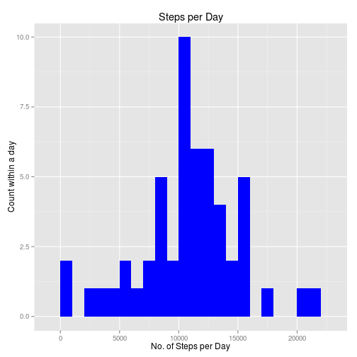

#Part One
##Loading and Preprocessing the data
The first step in this assignment is to load and preprocess the data.
First however it is necessary to clear the workspace.

```r
rm(list=ls())
```

unzip the data

```r
if(!file.exists('activity.csv')){
    unzip('activity.zip')
}
```
The neccessary libraries are the first thing to load.

```r
library(knitr)
library(data.table)
library(ggplot2) 
library(Hmisc)
```

Next the chunk options are to be set to echo="TRUE" so as to allow the reader to 
read the code

```r
opts_chunk$set(echo = TRUE, results = 'hold')
```

Now the data is to be loaded, assigning the correct variable type to them

```r
activity <- read.csv('activity.csv', header = TRUE, sep = ",",
                  colClasses=c("numeric", "character", "numeric"))
```

Lets have a look at it, observing the first five rows and the names of the variables

```r
head(activity)
names(activity)
```

```
##   steps       date interval
## 1    NA 2012-10-01        0
## 2    NA 2012-10-01        5
## 3    NA 2012-10-01       10
## 4    NA 2012-10-01       15
## 5    NA 2012-10-01       20
## 6    NA 2012-10-01       25
## [1] "steps"    "date"     "interval"
```

Next lets process the date variable to be read as a date

```r
activity$date <- as.Date(activity$date, format = "%Y-%m-%d")
```

Then lets change the interval variable to a factor:

```r
activity$interval <- as.factor(activity$interval)
```

Finally for use later, lets create a derived variable from the date variable which
simply denotes the day of the week

```r
activity$day<- weekdays(activity$date)
```
And to this we pass an ifelse statement which will denote whether the day falls
on a weekend or weekday

```r
activity <- cbind(activity, 
                      weekPos=ifelse(activity$day == "Saturday" | 
                                     activity$day == "Sunday", "weekend", 
                                     "weekday"))
```

After all this processing lets have a quick look at the final results:

```r
head(activity)
names(activity)
str(activity)
```

```
##   steps       date interval    day weekPos
## 1    NA 2012-10-01        0 Monday weekday
## 2    NA 2012-10-01        5 Monday weekday
## 3    NA 2012-10-01       10 Monday weekday
## 4    NA 2012-10-01       15 Monday weekday
## 5    NA 2012-10-01       20 Monday weekday
## 6    NA 2012-10-01       25 Monday weekday
## [1] "steps"    "date"     "interval" "day"      "weekPos" 
## 'data.frame':	17568 obs. of  5 variables:
##  $ steps   : num  NA NA NA NA NA NA NA NA NA NA ...
##  $ date    : Date, format: "2012-10-01" "2012-10-01" ...
##  $ interval: Factor w/ 288 levels "0","5","10","15",..: 1 2 3 4 5 6 7 8 9 10 ...
##  $ day     : chr  "Monday" "Monday" "Monday" "Monday" ...
##  $ weekPos : Factor w/ 2 levels "weekday","weekend": 1 1 1 1 1 1 1 1 1 1 ...
```

#Part Two
##Mean Total Steps per day

First we perform some simple aggregations into the mask of steps_per_day

```r
stepsDate <- aggregate(steps ~ date, activity, sum, na.rm = TRUE)
```

Then we rename the column names, as the mask would have produced the aggregated 
variable as x, whereas we want it to be simply called steps

```r
colnames(stepsDate) <- c("date","steps")
```

Now we observe the total number of steps taken per day. 

```r
stepsDate
```

```
##          date steps
## 1  2012-10-02   126
## 2  2012-10-03 11352
## 3  2012-10-04 12116
## 4  2012-10-05 13294
## 5  2012-10-06 15420
## 6  2012-10-07 11015
## 7  2012-10-09 12811
## 8  2012-10-10  9900
## 9  2012-10-11 10304
## 10 2012-10-12 17382
## 11 2012-10-13 12426
## 12 2012-10-14 15098
## 13 2012-10-15 10139
## 14 2012-10-16 15084
## 15 2012-10-17 13452
## 16 2012-10-18 10056
## 17 2012-10-19 11829
## 18 2012-10-20 10395
## 19 2012-10-21  8821
## 20 2012-10-22 13460
## 21 2012-10-23  8918
## 22 2012-10-24  8355
## 23 2012-10-25  2492
## 24 2012-10-26  6778
## 25 2012-10-27 10119
## 26 2012-10-28 11458
## 27 2012-10-29  5018
## 28 2012-10-30  9819
## 29 2012-10-31 15414
## 30 2012-11-02 10600
## 31 2012-11-03 10571
## 32 2012-11-05 10439
## 33 2012-11-06  8334
## 34 2012-11-07 12883
## 35 2012-11-08  3219
## 36 2012-11-11 12608
## 37 2012-11-12 10765
## 38 2012-11-13  7336
## 39 2012-11-15    41
## 40 2012-11-16  5441
## 41 2012-11-17 14339
## 42 2012-11-18 15110
## 43 2012-11-19  8841
## 44 2012-11-20  4472
## 45 2012-11-21 12787
## 46 2012-11-22 20427
## 47 2012-11-23 21194
## 48 2012-11-24 14478
## 49 2012-11-25 11834
## 50 2012-11-26 11162
## 51 2012-11-27 13646
## 52 2012-11-28 10183
## 53 2012-11-29  7047
```

Now we create the histogram using ggplot

```r
#Create the histogram
ggplot(stepsDate, aes(x = steps)) + 
    geom_histogram(fill = "blue", binwidth = 1000) + 
    labs(title="Steps per Day", 
         x = "No. of Steps per Day", y = "Count within a day")
```

 

Here we calculate the summary statistics of mean and median

```r
meanStepsDate  <- mean(stepsDate$steps, na.rm=TRUE)
medianStepsDate <- median(stepsDate$steps, na.rm=TRUE)
```
As we can see the mean is 

```r
meanStepsDate
```

```
## [1] 10766.19
```
And the Median is

```r
medianStepsDate
```

```
## [1] 10765
```

#Part Three
##Average Daily Activity Pattern

Fist thing we need to do is another simple aggregation, using the mean function
to find the average steps taken per interval

```r
intSteps <- aggregate(activity$steps, 
                                by = list(interval = activity$interval),
                                FUN=mean, na.rm=TRUE)
```

Next we change the interval figure to a number in our intSteps mask, allowing it to
be plotted.

```r
intSteps$interval <- 
    as.integer(levels(intSteps$interval)[intSteps$interval])
```

Then we proceed to change the column names of our intSteps mask for easy referal.

```r
names(intSteps) <- c("interval", "steps")
```

Finally lets have a quick look at the intSteps mask

```r
head(intSteps)
```

```
##   interval     steps
## 1        0 1.7169811
## 2        5 0.3396226
## 3       10 0.1320755
## 4       15 0.1509434
## 5       20 0.0754717
## 6       25 2.0943396
```
As everthing seems alright, we will proceed

Now we once more use ggplot to plot the time-series analysis

```r
ggplot(intSteps, aes(x=interval, y=steps)) +   
    geom_line(color="blue", size=1) +  
    labs(title="Average Daily Activity Pattern", x="Interval", y="No. of steps") 
```

 

For the last of this section we will find the maximum steps interval

```r
maxInt <- intSteps[which.max(  
    intSteps$steps),]
maxInt
```

```
##     interval    steps
## 104      835 206.1698
```
Thereby the maximum interval is the 835th with 206 steps

#Part Four
##Impute the missing values

Firstly we need to find the number of missing values/ rows with NA

```r
missing_values <- sum(is.na(activity$steps))
```

To impute the missing values we first create a mask to hold the newly create dataset
in, impMissVal

```r
impMissVal <- activity
```

From this we have choosen to use the Hmisc package in R to impute the missing values,
simply choosing the mean value as the imputed figure.

```r
impMissVal$steps <- impute(activity$steps, fun=mean)
```

As we have previously seen, the first several observations of steps have NA values.
Lets have a quick look to see if this is still the case

```r
head(impMissVal)
```

```
##     steps       date interval    day weekPos
## 1 37.3826 2012-10-01        0 Monday weekday
## 2 37.3826 2012-10-01        5 Monday weekday
## 3 37.3826 2012-10-01       10 Monday weekday
## 4 37.3826 2012-10-01       15 Monday weekday
## 5 37.3826 2012-10-01       20 Monday weekday
## 6 37.3826 2012-10-01       25 Monday weekday
```
This dataset (impMissVal) is therefore equal to the original dataset with missing values filled in and additional derived variables for later use.

Now, lets compress the data to the granular level of the date variable, summing all 
the steps. Then, as before, lets change the column names to make them recognisable.

```r
totalStepsDate <- aggregate(steps ~ date, impMissVal, sum)
colnames(totalStepsDate) <- c("date","steps")
```

Finally lets create the histogram to compare with the first

```r
ggplot(totalStepsDate, aes(x = steps)) + 
    geom_histogram(fill = "red", binwidth = 1000) + 
    labs(title="Histogram of Steps Taken per Day", 
         x = "No. Steps per Day", y = "No. times in a day")
```

 

#Part Five
##Difference in activity patterns between weekends and weekdays

The factor variable "week position" (weekPos) was previously created in our data preparation and processing phase. To verify that it is a factor variable with two outputs still in the Imputed Missing values Dataset (impMissVal):

```r
str(impMissVal)
```

```
## 'data.frame':	17568 obs. of  5 variables:
##  $ steps   :Class 'impute'  atomic [1:17568] 37.4 37.4 37.4 37.4 37.4 ...
##   .. ..- attr(*, "imputed")= int [1:2304] 1 2 3 4 5 6 7 8 9 10 ...
##  $ date    : Date, format: "2012-10-01" "2012-10-01" ...
##  $ interval: Factor w/ 288 levels "0","5","10","15",..: 1 2 3 4 5 6 7 8 9 10 ...
##  $ day     : chr  "Monday" "Monday" "Monday" "Monday" ...
##  $ weekPos : Factor w/ 2 levels "weekday","weekend": 1 1 1 1 1 1 1 1 1 1 ...
```

First we aggregate the activity patterns into the average imputed missing value mask 
(avImpMissVal) based on the averages for different days, keeping the week position variable (weekPos), the day variable (day), for now, and the interval itself.

```r
avImpMissVal <- aggregate(impMissVal$steps, 
                       by=list(impMissVal$weekPos, 
                               impMissVal$day, impMissVal$interval), mean)
```

Next we look at the final dataset, changing the names of the various variables for readabiliy

```r
head(avImpMissVal)
names(avImpMissVal) <- c("weekPos", "day", "interval", "average")
```

```
##   Group.1  Group.2 Group.3        x
## 1 weekday   Friday       0 8.307244
## 2 weekday   Monday       0 9.418355
## 3 weekend Saturday       0 4.672825
## 4 weekend   Sunday       0 4.672825
## 5 weekday Thursday       0 9.375844
## 6 weekday  Tuesday       0 0.000000
```


Finally lets knock together the graph, comparing weekends to weekdays

```r
ggplot(avImpMissVal, aes(interval, average)) + 
    geom_line(colour = "blue") + 
    facet_wrap(~ weekPos, nrow = 2, ncol = 1) +
    xlab("5-minute intervals") + 
    ylab("Average number of steps")
```

 

As we can see the both of these observation groupings roughly mirror each other, with slight discretions, in particuliar in the mornings where people seem more active at an early time.
